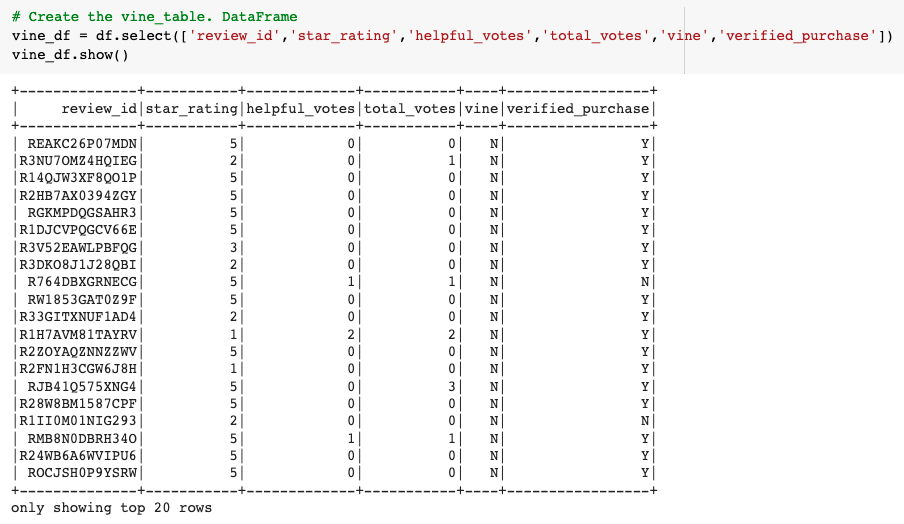
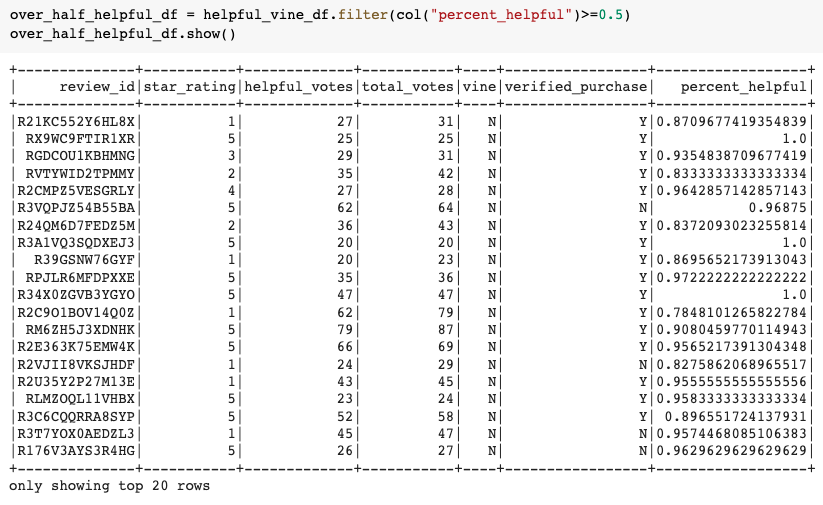

# Amazon_Vine_Analysis

## Overview
In this project, I am analyzing Amazon reviews written by members of the paid Amazon Vine program. The Amazon Vine program is a service that allows manufacturers and publishers to receive reviews for their products. Companies pay a small fee to Amazon and provide products to Amazon Vine members, who are then required to publish a review.

I chose to work with the Pet Products dataset (https://s3.amazonaws.com/amazon-reviews-pds/tsv/amazon_reviews_us_Pet_Products_v1_00.tsv.gz). I then used PySpark to perform the ETL process to extract the dataset, transform the data, connect to an AWS RDS instance, and load the transformed data into pgAdmin. Next, I used PySpark to determine if there is any bias toward favorable reviews from Vine members in the dataset. 

## Results
Amazon_Reviews_ETL.ipynb is a PySpark notebook that extracts the data Pet Products dataset and transforms it to load into existing tables in pgAdmin via AWS RDS. After running the final cells to export, I was able to "SELECT * FROM" the tables and confirm that the tables had been successfully populated with pertinent data.

In the second deliverable for this challenge, I created a new notebook Vine_Review_Analysis and recreated the vine_table data using PySpark. The image below shows the top 20 rows of the DataFrame created. 

|*Vine Table in PySpark DataFrame*|
|:--:|
||

I filtered the data to only show reviews that had at least 20 votes that were at least 50% helpful. Below is the resulting DataFrame with the added column "percent_helpful" which was found by dividing the number of helpful_votes by total_votes and then filtering to only show greater than or equal to 0.5. 

|*Reviews With Over 20 Votes and At Least 50% Helpful*|
|:--:|
||

Next I filtered for paid and unpaid reviews through the Vine program. I ultimately found that there are: 
- 38010 reviews with at least 20 total votes and whose helpfulness is greater than or equal to 50%
  - 170 of those are paid as part of the Vine program
  - 37840 are unpaid
- 20677 five-star reviews with at least 20 total votes and whose helpfulness is greater than or equal to 50%
  - 65 or 0.31% of those are paid as part of the Vine program
  - 20612 or 99.69% are unpaid
  

## Summary
Based on my calculations, it does not appear that the Vine program creates positivity bias for the reviews. There were only 170 of the 38010 reviews that I was analyzing that were part of the Vine program and therefore paid for. 65 of those 170, or 38%, were five-star reviews. For unpaid reviews, there were a total of 37840 and 20612, or 54%, were five-star reviews. Since the paid percentage of five-star reviews was lower than the  unpaid percentage, it would appear that the Vine program does not introduce positivity bias. 

One way to support this statement would be to run an additional analysis on the percentage of reviews voted more helpful when paid vs unpaid.